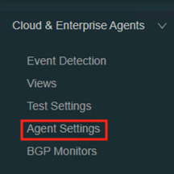
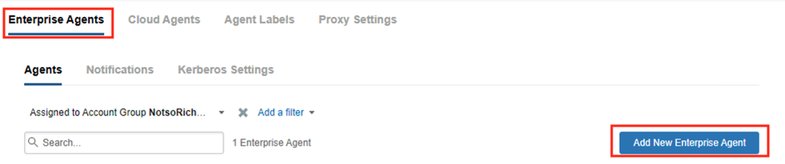
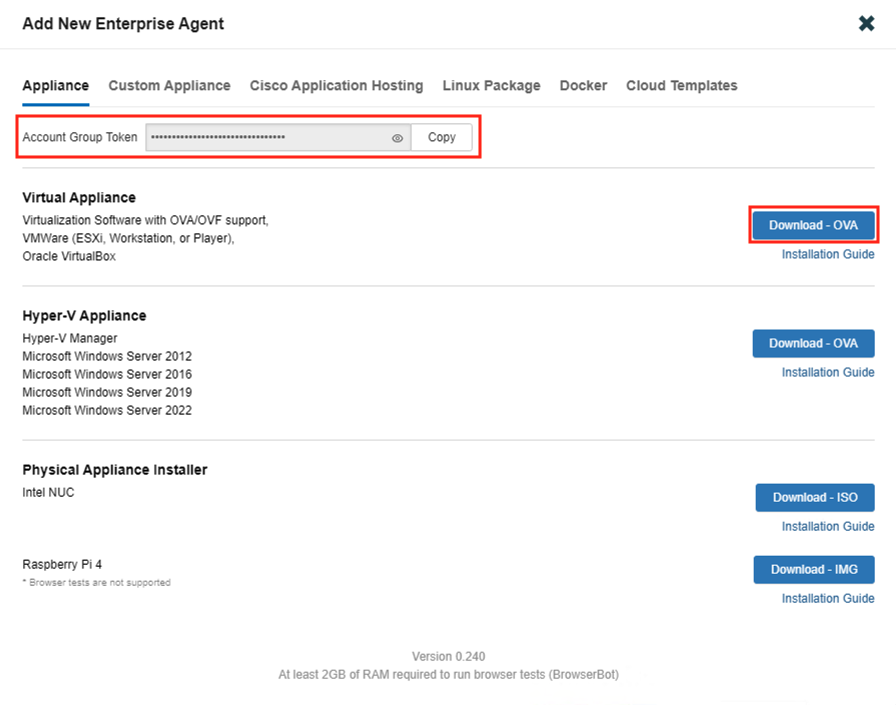
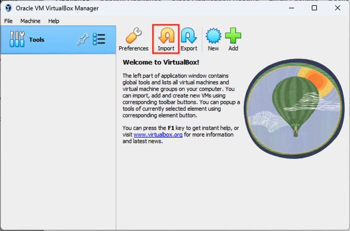
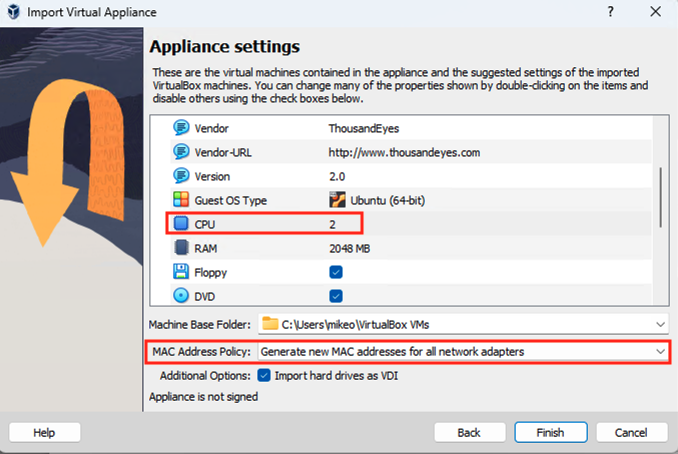
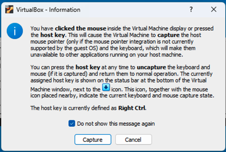
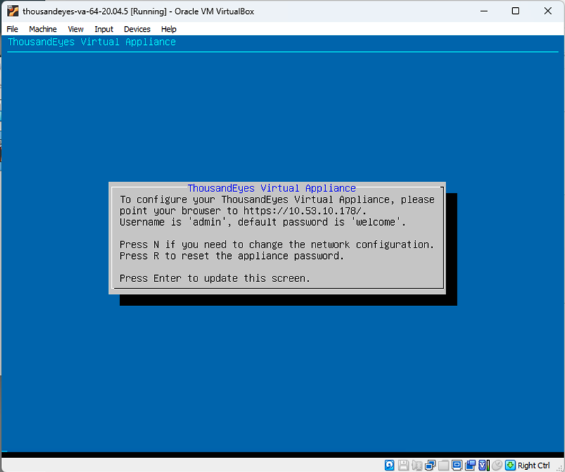
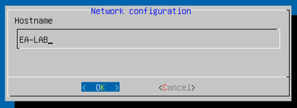
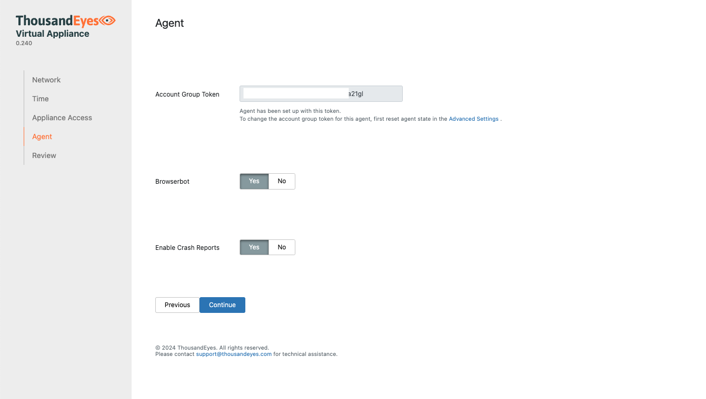

# Deploy Enterprise Agent

## Objective

Download the Enterprise Agent Software and import it into the Virtualization Environment.

## Login to the ThousandEyes Dashboard

Access https://app.thousandeyes.com and login

## Add New Enterprise Agent

In the left menu, navigate to `Cloud & Enterprise Agents > Agent Settings`

Click on the `Enterprise Agents` tab and click `Add New Enterprise Agent` from the menu

## Download The Virtual Appliance Software

Copy the `Account Group Token` and put it somewhere safe.

Choose the `Download - OVA` button. Confirm the default download location in the Downloads folder by clicking `Save`

## Open `Oracle VM VirtualBox`

## Install the OVA

Click the `Import` button. Click the yellow folder icon on the right, navigate to the `Downloads` folder, and choose the downloaded OVA file. Click `Open`.

## Change Appliance Settings

In the Appliance settings section, edit the `CPU` field and change it to `2`. At the bottom, under `MAC Address Policy`, click `Generate new MAC addresses for all network adapters`.

Click `Import`

## Click the `Start` button to turn on the imported virtual machine.

Click into the virtual machine console. VirtualBox displays notifications about the configured host key, which allows you to leave the console windows. The host key in this lab environment is configured as Alt. Choose `Do not show this message again` and click the `Capture` button.

## Set Agent Hostname

From the menu, press `N` 

Set `EA-LAB` as the hostname and press Enter.

## Configure IP addressing and DNS

For simplicity, keep `DHCP` for the IPv4 settings.

## Add `Account Group Token` to Agent settings

Enter the IPv4 Address assigned to your Agent into a web browser.

Bypass the certificate warning to enter the configuration GUI.

Click on the `Agent` tab and paste the `Account Group Token` saved earlier.

Give the Agent some time to save the configuration.

Click on the `Review` tab to see the status of the Agent.

