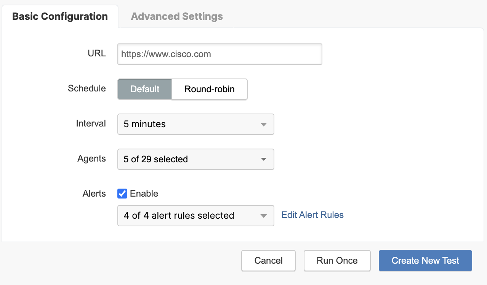

# Scheduling a Page Load Web Test

## Pre-Requisites

<a href ="https://docs.thousandeyes.com/product-documentation/getting-started/getting-started-with-account-setup">A ThousandEyes Account</a>

## Web Layer - Page Load Tests

<a href = "https://docs.thousandeyes.com/product-documentation/tests">ThousandEyes Tests</a>

<a href = "https://docs.thousandeyes.com/product-documentation/browser-synthetics/navigating-waterfall-charts-for-page-load-and-transaction-tests"> Navigating Waterfall Charts Documentation</a>

Page load tests use **te-chromium**, a browser based upon the Chromium browser codebase, to obtain in-browser site performance metrics. The metrics include the completed page load time and phase information for each DOM component.

## Schedule a Page Load Test

1. Navigate to https://app.thousandeyes.com

2. Navigate to `Cloud & Enterprise Agents > Test Settings`

3. In the `New Test` Settings, select the `Web` Layer, `Page Load` Test Type and configure any name and description you want.

4. On the top right hand corner, you will see the `Views Enabled for This Test` box to review the test parameters.

5. In the `Basic Configuration` section, enter `https://www.cisco.com` in the URL field. 

6. From the `Agents` drop-down menu, we will select five Cloud Agents

7. Leave all settings as default and click `Run Once`

8. A new browser tab will open and display the page load test. Verify the test was successful by observing the `Page Load Time` parameter. 

9. Go back to the other tab with the test settings and set the interval to 5 minutes. Click `Create New Test` to schedule the test. 

10. Navigate to `Cloud & Enterprise Agents > Views` to view the test report.

## Examine the Test Report

1. In the `Views` section, click the `Metrics` drop-down menu, you will see all available metrics. 

2. By default, the test displays the most recent round of data. Remember that an interval of 5 minutes was set when configuring the test. Change the test round by clicking on another section of the timeline, or by navigating with the arrow buttons at the bottom of the timeline.

The `Views` section allows you to observe historical test data for up to a month, even though Cisco ThousandEyes keeps some of the data longer.

3. In the bottom part of the test view are additional details on the metric you have chosen. Notice that there are three different tabs when the Page Load Time metric is chosen: `Map`, `Table`, `Waterfall`, and `Dependent Applications`.

4. Observe the `Map` tab. Notice that this tab shows you two windows. The left window shows you average metrics from all agents and the right window shows agents on the world map.

Agents are represented as circles in different colors, where colors are representing the performance of the Page Load Time metric.

5. Choose the `Table` tab of the Page Load metric.

This table gives you a comprehensive view of the test results from the individual agents that performed the test.

6. Choose the `Waterfall` tab of the Page Load metric.

Waterfall data is displayed if a specific agent is selected.

7. There is the `Agent` section with a drop-down menu located at the top of the page. Click the drop-down menu and choose one of the agents.

8. Examine the waterfall view that appeared on the bottom of the page for the agent you have selected.

This view can be used for determining which part of a web page is slowing things down. A developer can use this view and further optimize the web page.

9. Change the view to `HTTP Server` and remove the `filtered agent` (if selected) by clicking next to the name of the Agent in the Agent drop-down menu.

10. Notice that the `Status by Phase` section is shown when the `Metrics` parameter is set to `Availability`.

The Status by Phase section displays the phases of the HTTP layer.

11. Change the `Metrics` parameter to `Response Time` and open the `Table` tab.

The `Response Time` column in the table is showing response times that are calculated by summing all other time values from the `DNS Time`, `Connect Time`, `SSL Time`, and `Wait Time` columns.

12. Choose the `Agent to Server` view, choose `Loss` as metrics, open the `Table` tab, and observe the output.

You can see how the network was behaving when the test was performed by observing the `Error`, `Packet Loss`, `Latency`, and `Jitter` columns.

13. Choose the `Path Visualization` tab and observe the output at the bottom of the page.

14. To see all network hops, move the two hop sliders together at the top-right corner of the Path Visualization view.

15. Observe the topology. Notice that the utilized agents are shown on the left side of the page, and the destination server on the right side of the page. In the middle, you are presented with the different network paths that were used by the agents.

Paths consist of network hops that are represented as small circles.

16. Hover your mouse cursor over a network hop and observe the output. Additional information about the network hop is provided, including its owner and the selected metric such as latency or packet drop. If a hop experienced any issues, the hop would turn its color to orange or red, making it easy to spot. Also notice that the full path that goes through this hop was highlighted, including all agents that were using it.

17. Try different Highlight, Group, and Show options in the Path Visualization tab. You can select different parameters in the `Group` utility for troubleshooting.

