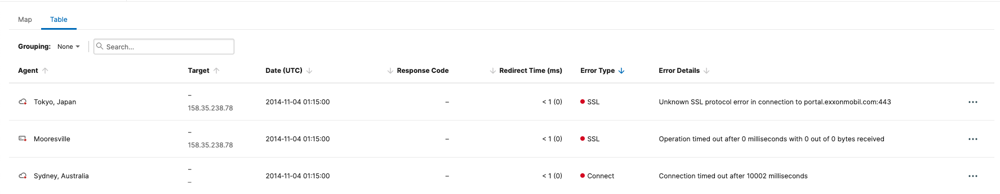
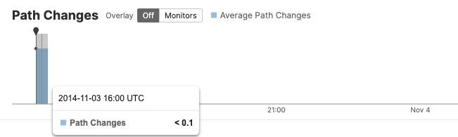

# Troubleshooting Scenario A

## Summary

<a href="https://iocvt.share.thousandeyes.com/view/tests/?roundId=1415109600&metric=availability&scenarioId=httpServer&testId=35834."> ThousandEyes Dashboard - Troubleshooting Scenario A - Exxon Portal</a>

- An alarm clock wakes you up at 6 AM and you need to take over the on-call duty role from your colleague. 

- Before the handover, you receive a quick briefing. Your colleague had a rough night. One of the on-premises web portals had major issues, which started in the late afternoon and lasted through the night.

- They ask you to analyze the collected details and help determine what was really going on. Management expects to receive a detailed briefing early in the morning.

## Instructions

1. Your first task is to determine additional details about the failure. Determine whether it is an **application issue** or **infrastructure issue**, and if there may be an issue with the **SSL load balancer** or the **local ISP**.

- Determining the nature of the failure will help you figure out to which internal team or responsible third party should the issue be escalated to. 

- Involving the right people early in the troubleshooting process can dramatically reduce the time needed for a resolution.

2. As the last task, try to collect as many details as possible about the potential root cause. Narrowing it down to a specific protocol, single node in the infrastructure, or to a link in the network enables the involved teams to quickly start addressing the issue or implement the needed workarounds to minimize the business impact.

Once you complete the given tasks, you can test your findings with the following questions.

After completing the questions, you will also be able to review one of the possible approaches to the troubleshoot procedures in a shared scenario step by step.

## Troubleshooting

- Checked the `Web - HTTP Server` test first: 

- Moved down the timeline that noticed the most prominent issue is an `SSL issue`:

- Clicked on the `Agent-to-Server` test and displayed `Path Visualization`

- Noticed most of the loss was occurring at the following node:

- Navigated to the `BGP Routing` menu and clicked on the time slice that indicates the path change events.

- From the `BGP routing` menu, click on the `Warnings` drop down menu and click on the warning details:

- Clicking on the warning details will automatically isolate the affected nodes in the path trace:

## Question 1: 

Which part of the Infrastructure was responsible for detected issues that started appearing in the late afternoon?

Correct Answer:

- network layer - upstream or intermittent ISP

## Question 2: 

To which two internal teams or responsible third parties should you escalate the detected issue, to facilitate the quickest time to resolution?

Correct Answers:

- Internal network team responsible for a local and public internet connectivity

- external upstream ISP **internap**

## Question 3: 

Which three options are the most probable root causes?

- Internap PE router issue

- PE-CE link issue

- CE router issue

