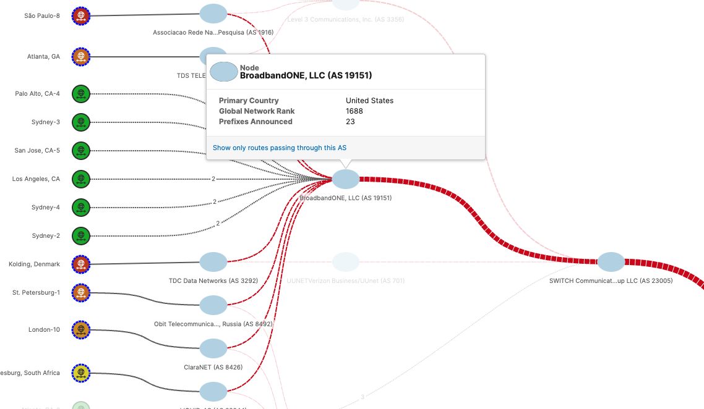

## Summary

<a href ="https://shtzrx.share.thousandeyes.com/view/cloud-and-enterprise-agents/?roundId=1449912600&metric=availability&scenarioId=httpServer&testId=84099"> Troubleshooting Scenario B - GoToMeeting</a>

As a senior engineer, working from the San Francisco office, you are enjoying a quiet morning until you receive an escalated ticket. 

Senior management organized an important sales conference call earlier in the day, while you were still sleeping. Several employees complained after the event that they had difficulties following the conference, some even connecting to it.

You are tasked to analyze the situation and figure out what was going on.

## Instructions

1. Your first task is to determine more details about the detected issues. Who was impacted, and what was the nature of the issue?1

- Try to determine the responsible party for the issue.

2. As the last task, try to determine the probable root cause.

## Troubleshooting

- Using the time slices in the timline and `Table` menu, I identified that the most amount of sites affected were 4:

- Using the `Path Visualization` utility, I determined that the responsible party was BroadbandOne, LLC (AS 19151)

- Using the `BGP Route Visualization` details, we determined that there were withdrawn and newly announced routes in BroadbandOne:

## Question 1: 

How many branch locations were impacted by the outage?

- Four

## Question 2: 

Which party is responsible for the outage?

- BroadbandOne, LLC (AS 19151)

## Question 3: 

What caused the captured changes in the BGP routing table?

- Withdrawn and newly announced routes in BroadbandOne, LLC autonomous system

