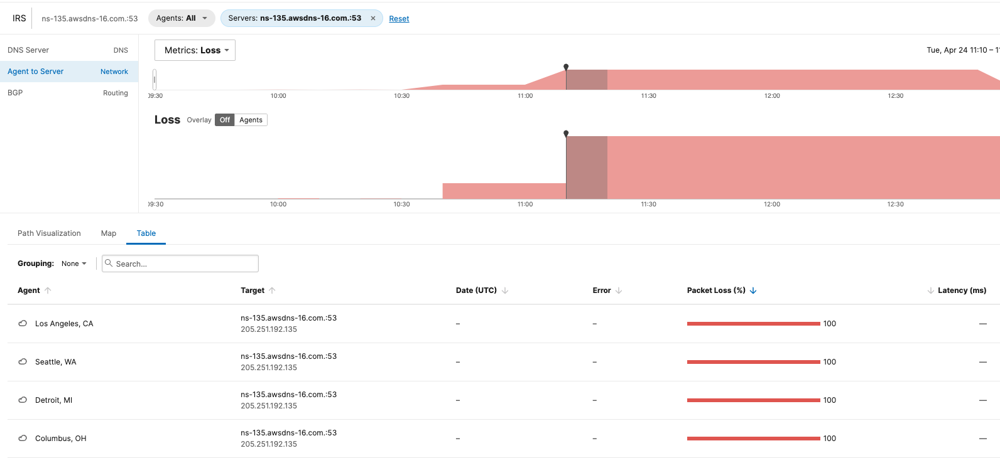
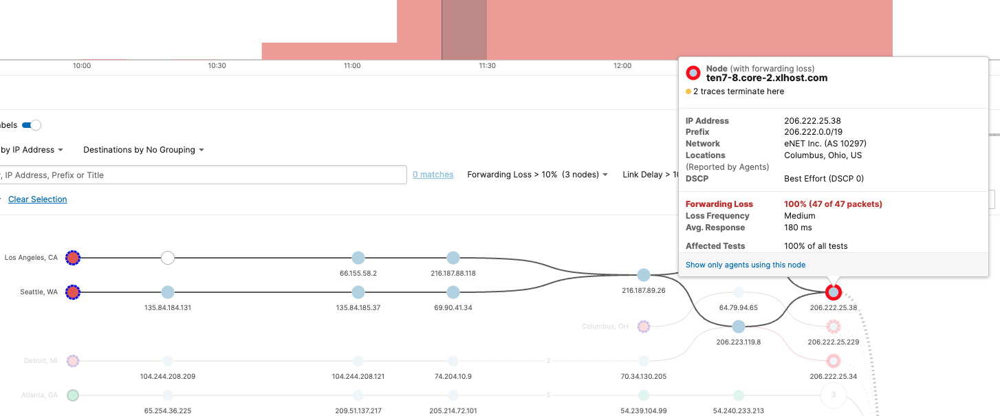
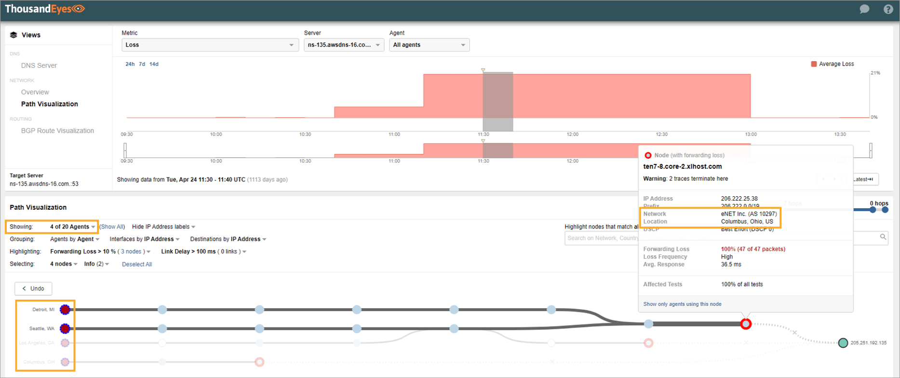
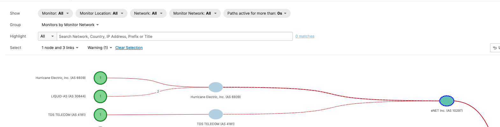

## Summary

<a href = "https://webysvi.share.thousandeyes.com/view/cloud-and-enterprise-agents/?roundId=1524569400&metric=availability&scenarioId=dnsServer&testId=619444&serverId=239927">Troubleshooting Scenario C - IRS</a>

You are working from a London office, when a colleague from New York reaches out and asks you for help.

Several customers have reported difficulties accessing the web service. He is on his way to the office, but the issue is critical.

The colleague has determined the issue might be related to the DNS availability but asks you to investigate in detail.

## Instructions

1. Your first task is to analyze the outage. Determine the nature of the issue and impacted locations.

2. Your second task is to identify the responsible party.

3. Finding potential root cause always allows you to be more successful when escalating the issue. This is your last task.

## Troubleshooting

- Primary test is a DNS Server test to `ns-135.awsdns-16.com:53`

- Navigated to the `Agent to Server` testing menu and looked at the time slices with errors in the timeline:

The four affected regions include:

1. Los Angeles

2. Seattle

3. Detroit

4. Columbus

- Navigated to the `Path Visualization` view and isolated the following problem nodes:

- The issues seem to be isolated to `eNET Inc (AS 10297)`

- In the BGP analysis, I noticed the following issues:

## Question 1: 

Choose all four impacted locations where the outage was detected.

- Columbus, OH

- Detroit, MI

- Los Angeles, CA

- Seattle, WA

## Question 2:

Identify which autonomous system there are connectivity issues

- eNET Inc (AS 10297)

## Question 3: 

What is the most probably root cause for captured connectivity issues?

- misconfigured or maliciously advertised more specific BGP Prefix

