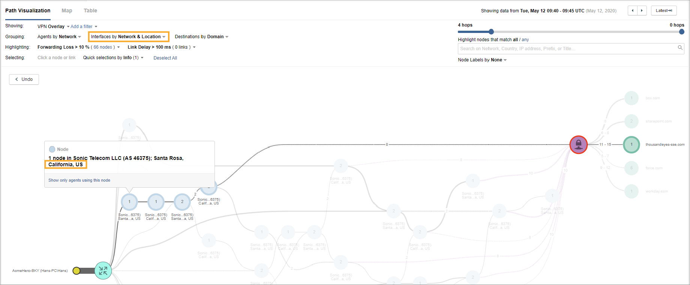

## Summary

<a href="https://fkrtqjkhb.share.thousandeyes.com/view/endpoint-agent/?roundId=1589276400">Troubleshooting Scenario D</a>

Senior project manager Hans has reached out due to issues with his PC. He has recently returned from a business trip abroad, and today he noticed standard business apps perform very poorly. Luckily, he has another device (Mac) which works fine, so he can continue with his work process while his PC issue is being investigated.

Once you finally return to it, the following collected information waits for you:

- Affected user: Hans.

- Affected equipment: HANS-PC (Dell OptiPlex 7010) running Windows 7.

- Affected applications: Workday, SharePoint, performing much slower than on a usual day.

**Initial analysis**: Hans-PC is up to date. His operating system and installed software look normal. Hans worked from his home office in California, US when he experienced the issues.

Your team members also suspect it might be the network issue, so they pass you the link for ThousandEyes results and suggest you examine it.

## Instructions

Your first task is to determine more details about the reported issue. To try find some meaningful data that would reflect what affected end user Hans is experiencing.

The second task is to try and determine what might be the root cause behind the issue and who might be responsible for it.

## Troubleshooting

- Used the `User` drop-down menu to filter for Hans:

- Clicked on `www.workday.com` to view more details around the Loss and Latency being experienced by Hans' PC.

- Clicked on the `Waterfall` tab to get more detailed insight into the long page load times:

- To better understand the reason for the increased network delay, I switched to the `Network` layer to observe the Path Visualization. Notice how the VPN headend and many hops in the path influence visualization. Double click the aggregated hops in front of the VPN headend to expand it.

- Changing different Grouping options allows you to influence the details of the visualization. 

- Switching Interfaces to Network & Location allows you to easily analyze geographic locations of different hops in the path. Notice how the first hops really reflect what you know about Hans. He was really working from his home office in California when he experienced the issues.

- Continue analyzing the geolocations of additional hops in the path. Focus also on the VPN headend and target destinations. It is unusual for the traffic to flow across hops in Europe, when heading toward any mayor SaaS provider, if user is based in the US. Notice that one of the reasons for that might be the fact, that VPN headend is located in the UK.

## Question 1:

Which metric experienced the greatest degradation?

- latency

## Question 2: 

What is the most likely root cause of the issue?

- VPN headend geographic location

